# NovelAgent 

> 本指南以 **Web 工作台为主线**介绍 NovelAgent 怎么用：启动网页 → 新建项目 → 七步向导走通创作闭环 → 写作间出稿 → 在网页里完成模型 / 空间 / RAG / 提示词等全部配置。
> 命令行（CLI）作为**能力同源的等价入口**放在后半部分，适合批处理与自动化场景。

所有页面截图见 [`docs/screenshots/`](docs/screenshots/)。

---

## 一、NovelAgent 是什么

NovelAgent 是一个**共创式长篇小说写作 Agent**：给它一段思路（题材 / 核心梗 / 风格 / 体量），它能自主完成「世界观 → 大纲 → 角色 → 逐章写作 → 成书评测」全流程，并以「不崩」七维终审量化保证质量。

它不像普通「AI 写作工具」那样给你一个对话框，而是给你一整个**编辑部**。核心能力一览：

- **25 位专家 Agent 组成的完整创作团队**：世界观架构师、地理志官、人物设计师、设定考据员、力量体系师、时间线管家负责搭建世界；卷纲策划、章节编排师、冲突设计师、伏笔管家、节奏调度官、导演 Agent 负责推进情节；成文润色与审校把关两组负责每章成稿质量。每一道工序都有专精的 Agent 负责，它们围绕同一个世界状态协同工作，**你只管当总编**，方向和拍板始终在你手里（「Agent 阵容」页可查看全员职责）；
- **世界先于文字**：先建一个可计算、可追溯的世界，再让文字从中生长。人物处境、势力消长、物品去向、伏笔的埋设与回收，被结构化地记录与推演——写完一章，世界就「前进一格」，下一章永远基于一个自治的当下。长篇创作最大的敌人不是灵感枯竭，而是**设定的崩塌与记忆的流失**，NovelAgent 的全部工程都为对抗这两件事而生；
- **主动权在你**：0–100 连续自主度滑块，从「逐步陪同」（Co-pilot）到「全自动推进」（Auto Driver）随意调；无论调到多高，重大决策始终打断交给你拍板，Agent 只辅助、不越权；
- **七步向导走通创作闭环**：开新书 → 脉络讨论 → 故事架构 → 确认架构 → 创作大纲 → 角色设计 → 写章节，每步一键生成、就地修改；改了上游世界观，下游自动提示复核，绝不让设定悄悄烂掉；
- **实时写作间**：点一下写下一章，或一键连写多章；写作过程全程透明——实时日志、章节时间线、成本预警随时可见；
- **质量门禁**：每章多重校验（爽点 / OOC / 连贯性 / 追读力 / AI 味 / 注水 / 黄金三章），不通过自动修订；伏笔由确定性状态机管理（埋设→强化→回收），逾期未回收自动标记；
- **写错了能后退**：快照、回滚、归档，随时可逆；
- **配置全在网页上**：模型、项目空间、检索、提示词都有可视化配置页，日常使用不需要碰配置文件。

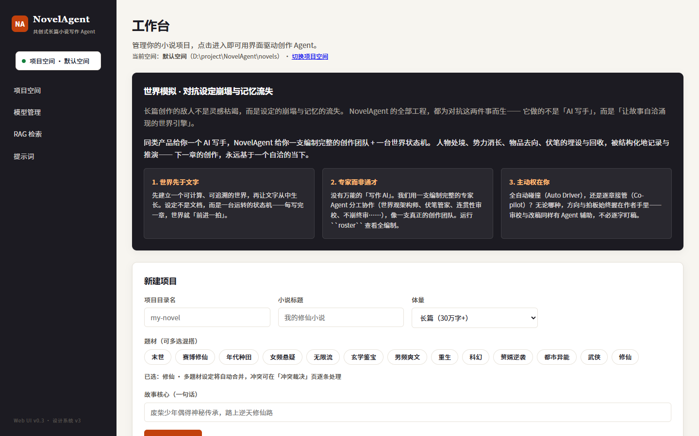

---

## 二、安装与启动

### 2.1 环境要求

- **Python 3.11+**，能联网装包（`pip`）。

### 2.2 安装

应用与编排内核（llmagent）统一在一个包内，一次安装即可：

```bash
# 方式 A：正式安装（构建 wheel）
pip install ./agent

# 方式 B：editable 安装（改源码即时生效，推荐开发 / 调试期）
pip install -e ./agent
```

Web UI 依赖 `fastapi`、`uvicorn`、`python-multipart`，均已写入 `pyproject.toml`，随包自动安装。

### 2.3 启动 Web 工作台

```bash
novel-agent web                     # 默认 http://127.0.0.1:8000
novel-agent web --host 0.0.0.0 --port 8080   # 指定监听地址 / 端口
```

等价写法：`python -m agent.cli web` 或 `python -m agent.web`。浏览器打开后按 `Ctrl-C` 停止服务。

> 若报 `ModuleNotFoundError: No module named 'uvicorn'`，重跑一次安装命令即可。

### 2.4 小说数据放在哪

- **默认位置**：仓库根目录下的 `novels/`（与 `agent/` 代码目录平级，代码与数据分离）。页面上每个项目 = 该目录下的一个子文件夹。
- **想换位置**：无需改环境变量——打开 **「项目空间」页（`/settings`）** 即可登记多个本地目录并随时切换，CLI 子进程会跟随当前空间：

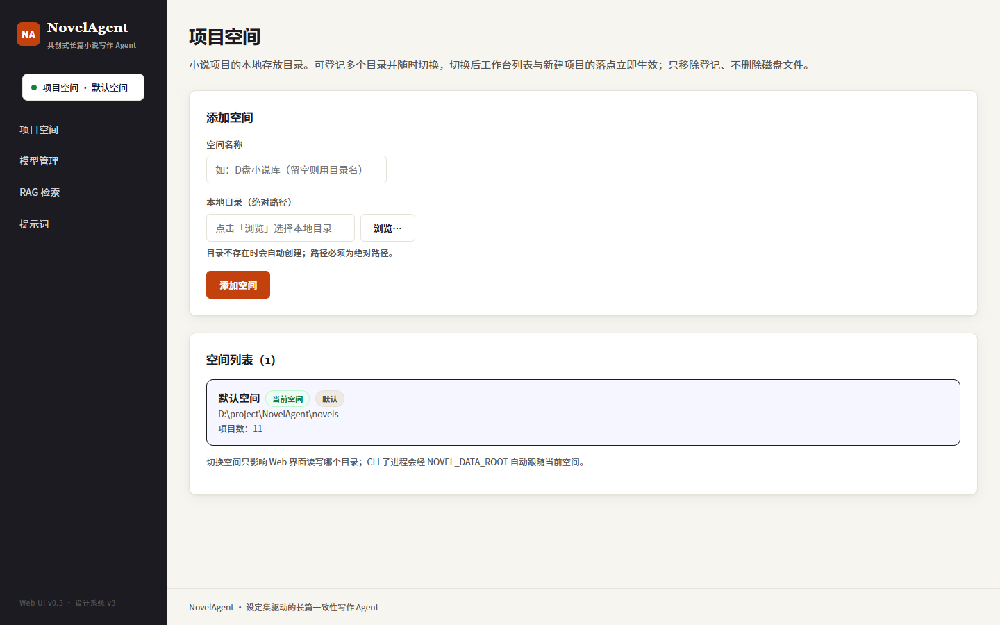

- 兼容做法：环境变量 `NOVEL_DATA_ROOT` 也可覆盖数据根目录。

---

## 三、五分钟上手（纯网页流程）

```bash
pip install -e ./agent      # ① 安装
novel-agent web             # ② 启动，浏览器打开 http://127.0.0.1:8000
```

③ 在工作台首页「新建项目」：填项目目录名 / 小说标题 / 体量，点选题材 chips（可多选混搭，多题材设定冲突稍后在「冲突裁决」页逐条裁决），写一句故事核心，点「创建」。
④ 进入项目后点「打开引导向导」，七步走通创作闭环（见 §4.3）。
⑤ 到第 ⑦ 步进入「实时写作间」，点「写下一章」或「⚡ 自动续写」开始产出（见 §4.4）。
⑥ 写完在「看板」做全书评测，或直接导出成书。

> 首次使用请先到 **「模型管理」** 配好大模型（见 §5.1），否则写作任务会因缺少 API Key 失败。

---

## 四、Web 工作台详解

### 4.1 工作台首页（`/`）

项目列表 + 新建项目入口。顶部是产品哲学文案与「项目空间」切换；新建表单支持**多题材 chips 多选混搭**（如修仙+武侠+科幻），多题材的设定段落自动合并，同名设定冲突生成冲突卡。

### 4.2 项目工作台（`/p/{name}`）

进入项目后的总控面板：当前阶段、已写章数、累计 Token、题材一目了然；「下一步」卡片按状态机给出唯一推荐动作；「创作旅程」时间线可视化八阶段进度；下方是创作 / 阅读 / 调校三组入口，其中「创作调校」是 **0–100 连续自主度滑块**（左 `Director` → 中 `Co-pilot` → 右 `Auto Driver`，快捷按钮一键跳 100 / 35；无论调到多高，`MAJOR_DECISION` 始终打断作为安全底线）。底部「高级命令」折叠区列出当前状态机允许的全部命令并可直接运行——命令行能跑的网页都能跑。

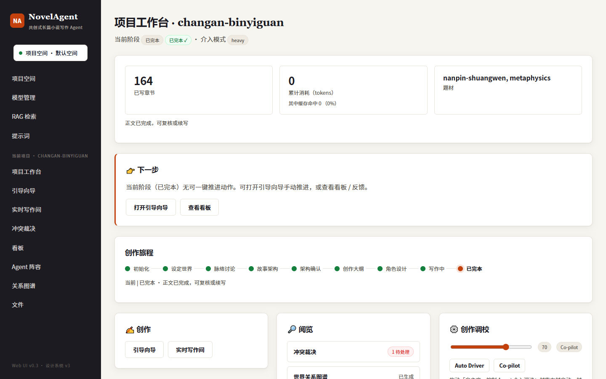

### 4.3 引导向导：七步走通创作闭环（`/p/{name}/guide`）

新书上手的主路径。把创作流程拆成 7 个阶段页，每页做三件事：**回显上一阶段产物 → 一键生成本阶段产物 → 就地编辑保存**。

| # | 阶段页 | 产物 | 一键动作 |
| - | ------ | ---- | -------- |
| ① | 开新书 | `world.md` | 生成世界观 |
| ② | 脉络讨论 | `discussion.md` | 开始讨论 |
| ③ | 故事架构 | `architecture.md` | 生成架构 |
| ④ | 确认架构 | — | 确认并解锁下游 |
| ⑤ | 创作大纲 | `outline.md` | 生成大纲 |
| ⑥ | 角色设计 | `characters/*.md` | 设计角色 |
| ⑦ | 写章节 | `chapters/chNNN.md` | 进入写作间 |

实用细节：

- **自动定位**：直接访问 `/p/{name}/guide` 会按项目当前状态重定向到你该去的那一页；
- **进度条可点击**：七段进度条任意跳转，回看 / 补改已完成阶段；
- **就地编辑**：产物渲染为富文本，点编辑可直接改 `world.md` / `outline.md` 并写回本地；已生成过产物的阶段允许直接编辑，不受状态机门禁限制；
- **阶段复核**：上游产物被改动后，下游阶段标为「受影响·待复核」，点「生成检查单」由 LLM 找出未覆盖或与新设定冲突的条目，逐条采纳 / 忽略，确认后记录新基线；
- **一键全自动写书**：任意阶段都可展开「跳过多步确认：一键全自动写书（compose）」。

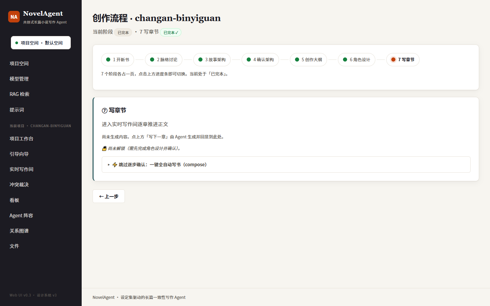

### 4.4 实时写作间（`/p/{name}/write`）

三栏布局：左侧本章上下文（进度 / 累计 Token / 质量门禁），中间已生成章节流水（点标题直接看文件），右侧 SSE 实时日志。底部操作条：

- **写下一章**：单章产出，可选引擎模式（`auto` / `heavy` / `light`）与严格质量审查开关；
- **⚡ 自动续写**：填「再写几章」，连续推进到目标章数（前端自动叠加当前章数换算绝对目标，重跑不会从头写）。

运行时点任意动作弹出运行控制台，分「日志 / 时间线 / 状态」三栏：日志是 CLI 子进程实时输出，时间线是进度事件（第 N 章、当前阶段、耗时）；触发成本预警会在卡片上直接显示等级。

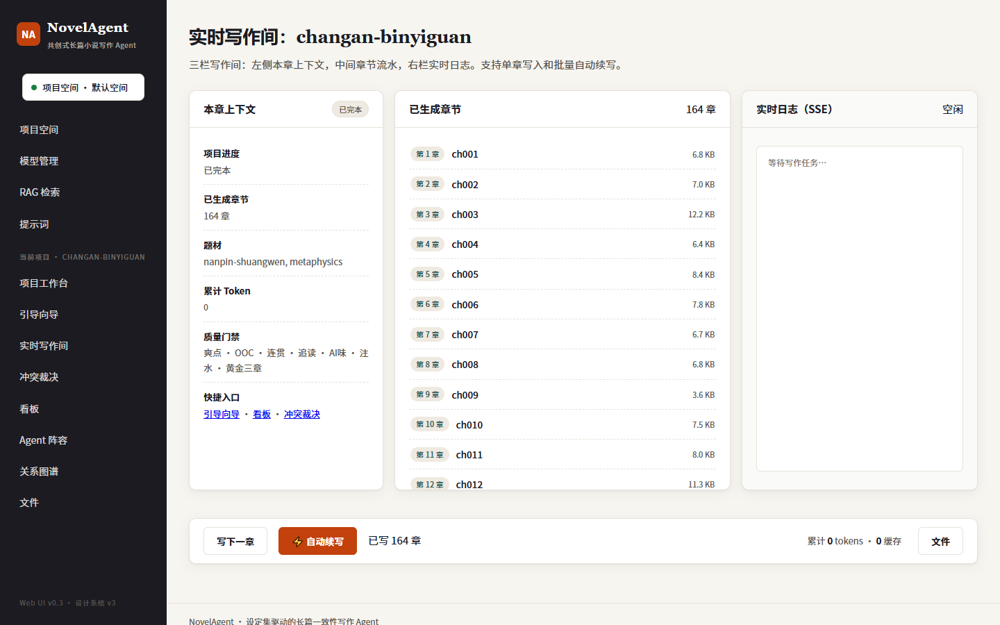

### 4.5 看板（`/p/{name}/dashboard`）

LLMOps 观测快照：累计 Token / 评测次数 / 本地与远程工具数；快捷动作（一致性审计、伏笔回收报告、全书评测）；模型路由健康表（各路由的模型、用途、优先级、成本与可用状态）。

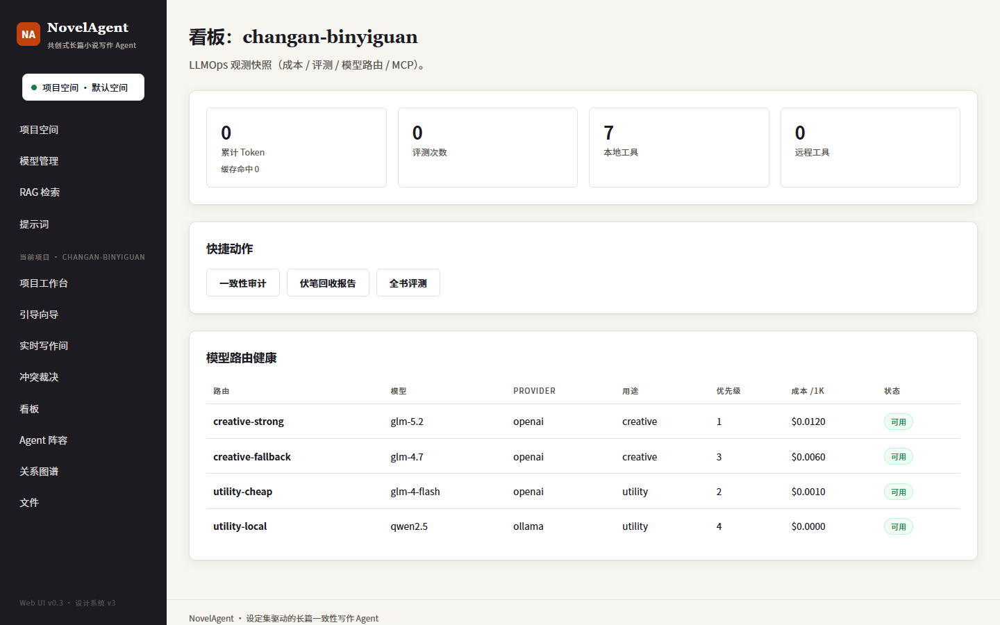

### 4.6 世界构建页面

| 页面 | 路径 | 能做什么 |
| ---- | ---- | -------- |
| 世界关系图谱 | `/p/{name}/graph` | 力导向图**可拖拽编排**，5 类节点（人物/势力/地点/物品/伏笔）按类型着色，点选编辑，「从项目数据生成」一键建图，拖动后坐标自动保存 |
| Agent 阵容 | `/p/{name}/team` | 25 位专家 Agent 按四组（世界构建 6 / 情节叙事 7 / 成文润色 5 / 审校把关 7）展示职责与落地引擎 |
| 冲突裁决 | `/p/{name}/conflicts` | 多题材同名设定冲突逐条裁决（保留一方或手写合并文本），「应用裁决并写回」收敛为本小说自有设定 |
| 文件浏览 | `/p/{name}/files` | 浏览项目全部 markdown 产物，点开即读 |

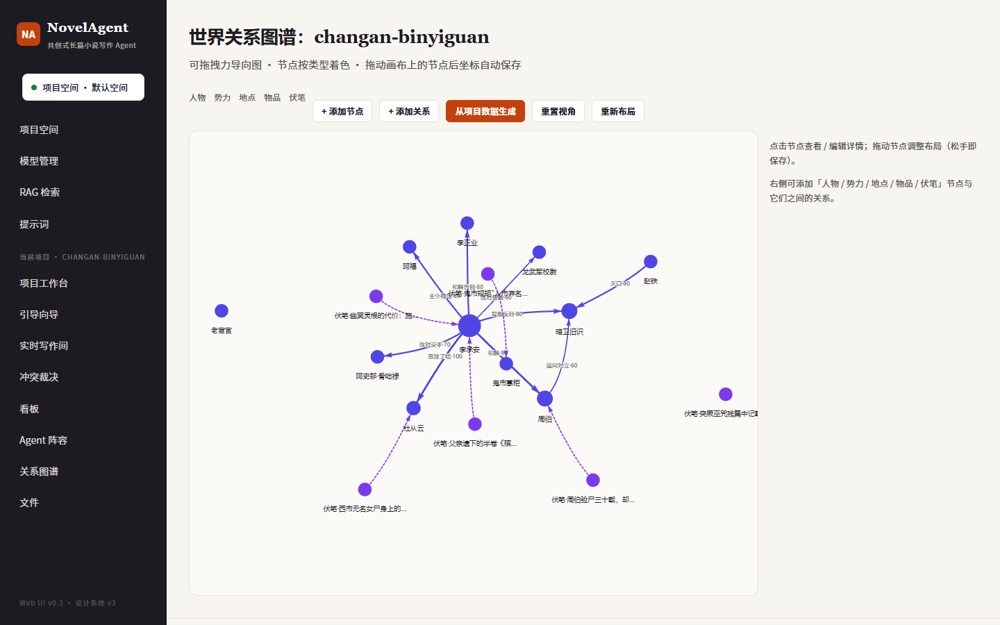

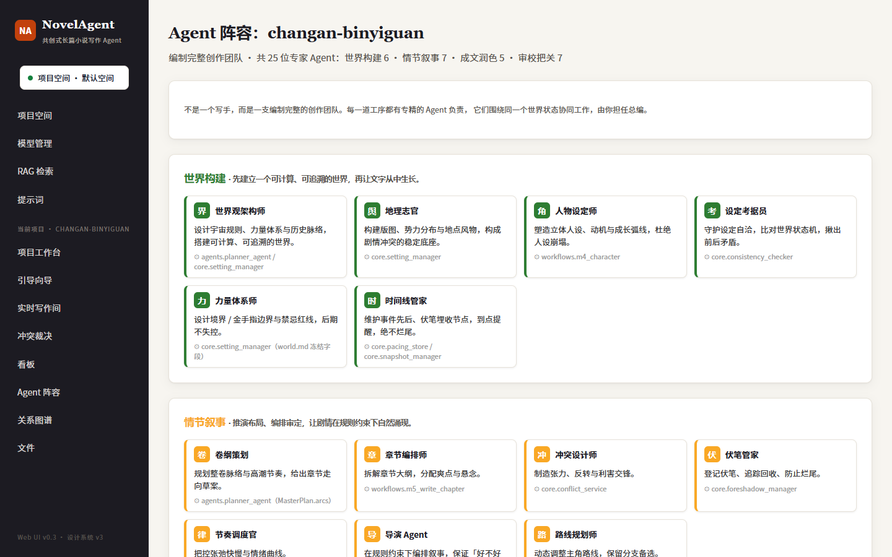

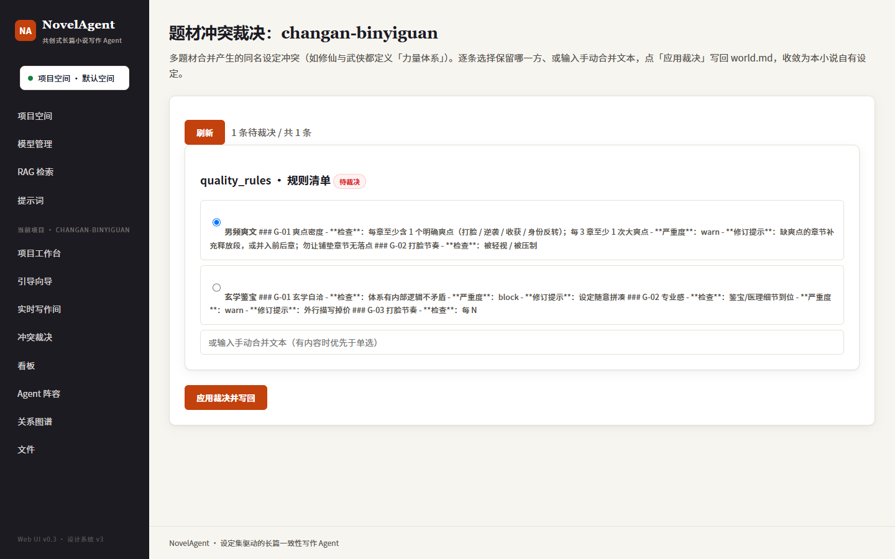

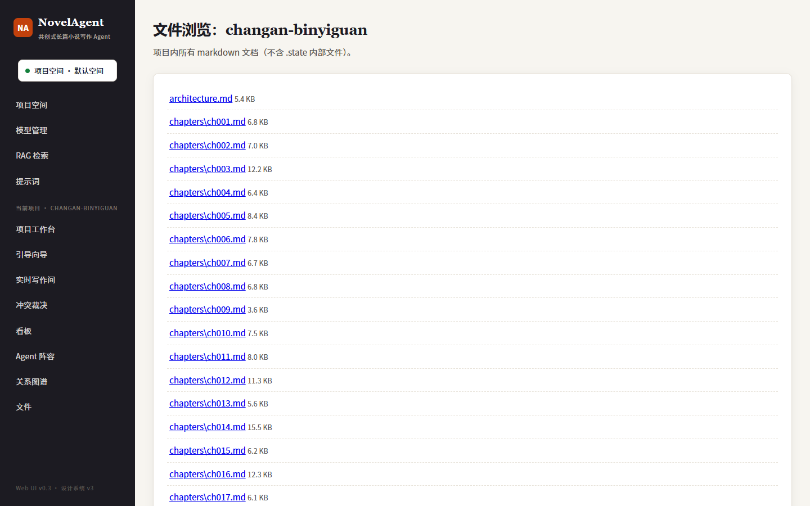

---

## 五、配置中心（全部在网页上完成）

日常配置**不再需要手改 `.env`**，四个配置页覆盖模型、空间、检索与提示词。

### 5.1 模型管理（`/models`）—— 替代 `.env` 的主配置入口

在界面集中配置所有可用模型：新增 / 编辑模型档案（Base URL、API Key、模型 ID、思考开关、超时）、一键**导入当前 `.env` 配置**、设为默认、**连通性测试**、按次临时切换（写作间里可指定本章用哪个模型，不影响默认）。API Key 仅保存在本地 `models.json`，不会上传。

工作方式：默认模型优先级高于 `.env`；`.env` 中的嵌入模型（`EMBEDDING_*`）等配置仍然生效，作为兼容后门保留。

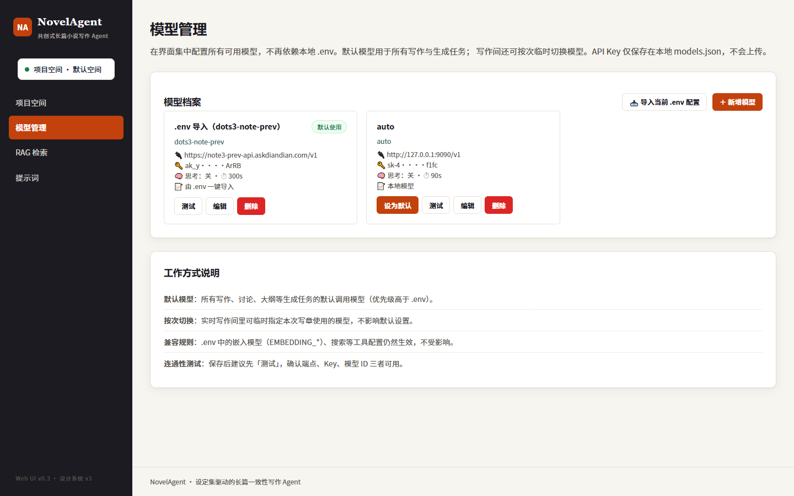

### 5.2 项目空间（`/settings`）

登记多个本地目录作为数据根并随时切换；只移除登记、不删磁盘文件。切换后工作台列表与新建项目落点立即生效，CLI 子进程自动跟随（见 §2.4）。

### 5.3 RAG 检索（`/rag`）

配置 Embedding 提供方（本地 HF 模型离线推理或 OpenAI 兼容端点）、模型、HF 缓存目录与镜像、推理设备；查看各项目的语义索引状态（切片数 / 向量数 / 维度 / 更新时间）并按需**重建索引**。写后即存 `.env`，即时生效无需重启。

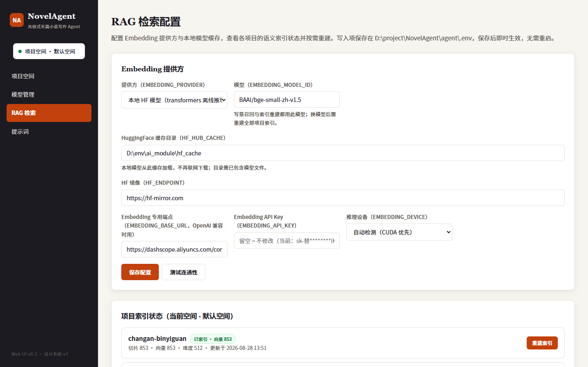

### 5.4 提示词（`/prompts`）

`prompts/` 目录下的 Markdown 提示词是**单一真源**：CLI 短进程按文件 mtime 改即生效，Web 长驻进程由后台线程每 5 秒轮询自动重载。此页面列出全部提示词（版本 / 模型 / temperature / 来源 / 最近更新），改动后可手动「重载缓存」。

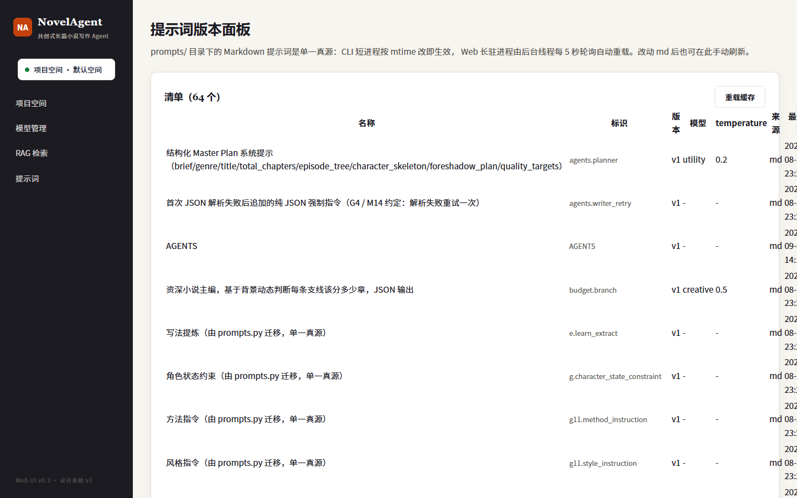

### 5.5 兼容：`.env` 直配（可选）

仍可跳过网页、直接写 `agent/.env`（模型管理页也能从它一键导入）：

```dotenv
LLM_PROVIDER=openai
LLM_API_KEY=你的APIKey
LLM_BASE_URL=https://open.bigmodel.cn/api/paas/v4/
LLM_MODEL_ID=glm-4.7
LLM_MODEL_UTILITY=glm-4.7
LLM_TIMEOUT=180
LLM_MAX_RETRIES=3
LLM_ENABLE_THINKING=false
```

任何兼容 OpenAI 协议的服务（OpenAI / DeepSeek / Kimi / 智谱…）改 `LLM_BASE_URL` / `LLM_MODEL_ID` / `LLM_API_KEY` 三项即可；本地零成本方案用 `LLM_PROVIDER=ollama` + `LLM_BASE_URL=http://localhost:11434`（无需 Key）。`.env` 含密钥，不要提交到 git。

---

## 六、CLI 等价入口

Web 端以子进程调用同一份 CLI（`python -m agent.cli <command>`），两者能力**完全一致**、可混用：

| 想做的事 | CLI 命令 | Web 入口 |
| -------- | -------- | -------- |
| 启动软件 | `web` | —（它就是 Web 本身） |
| 开新书 | `start` / `compose` | 新建项目表单 / 向导 ① |
| 写章节 | `write` | 写作间「写下一章」 |
| 自动续写 | `autowrite --chapters N` | 写作间「⚡ 自动续写」 |
| 一键写完整本 | `compose --name ... --chapters N` | 向导「一键全自动写书」 |
| 调自主度 | `mode --autonomy N` | 项目工作台「创作调校」滑块 |
| 看状态 | `status` | 项目工作台 |
| 体检 / 评测 | `doctor` / `evaluate` | 看板快捷动作 |
| 导出成书 | `export -f txt/markdown/epub` | 项目工作台导出入口 |

命令行入口统一为 `novel-agent`（安装后），等价于 `python -m agent.cli`；所有命令接受 `-d/--dir <项目目录>`。内部有状态机门禁（INIT → 配置/讨论 → 架构确认 → 大纲 → 角色 → 写作 → 完结），在错误阶段运行会被拒绝并提示下一步，照着向导顺序走即可。

### 6.1 最常用命令

```bash
# 全自主写作：给一段思路，自动完成整本书
novel-agent autowrite -d novels/my-novel --brief "玄幻+废柴逆袭+爽文" --chapters 30

# 一键开新书并写到完本（含完本去重与自动体检）
novel-agent compose --name "我的修仙路" --scope long --genre xiuxian \
    --story-core "废柴逆袭，一路打脸" --chapters 120
novel-agent compose -d novels/my-novel --chapters 30      # 续写已有项目

# 分步共创
novel-agent start             -d novels/my-novel   # 开新书 → world.md
novel-agent discuss           -d novels/my-novel   # 脉络讨论（/next 结束）
novel-agent architecture      -d novels/my-novel   # 故事架构
novel-agent confirm-architecture -d novels/my-novel
novel-agent outline           -d novels/my-novel   # 大纲 + 各支线 subline
novel-agent design-characters -d novels/my-novel   # 角色/关系/伏笔/金手指
novel-agent write             -d novels/my-novel   # 写下一章（核心循环）

# 一致性演化：关系网 / 主角路线随剧情调整（旧版本归档不删，附影响报告）
novel-agent adjust-relation -d novels/my-novel -i "赵无极对林寻从对立转为暗中赏识"
novel-agent adjust-route    -d novels/my-novel -i "主角在N02加入执法堂当卧底，后期反水"

# 成书质量
novel-agent evaluate       -d novels/my-novel        # 「不崩」七维终审
novel-agent appeal         -d novels/my-novel --chapter 12   # 「迷爱看」6 维评分
novel-agent guardrail-scan -d novels/my-novel        # 质量护栏全量扫描
novel-agent review-book    -d novels/my-novel        # 多视角对抗式评审
novel-agent deslop         -d novels/my-novel --apply  # 批量去 AI 味（先报告后改写）
novel-agent rewrite -d novels/my-novel --chapter 12 --feedback "节奏太快，放慢补细节"

# 导出与安全网
novel-agent export  -d novels/my-novel -f epub -o ./output
novel-agent snapshot -d novels/my-novel -l before-revision
novel-agent rollback -d novels/my-novel -c 20           # 回滚到第 20 章，后续章节归档不删

# 诊断与维护
novel-agent status / doctor / continuity / foreshadow-report / reindex / resume
```

### 6.2 命令分组速查

| 分组 | 命令 |
| ---- | ---- |
| 核心创作 | `autowrite` `compose` `start` `discuss` `architecture` `confirm-architecture` `outline` `design-characters` `write` `adjust-relation` `adjust-route` `export` |
| 成书质量 | `evaluate` `appeal` `guardrail-scan` `review-book` `rewrite` `repair` `deslop` `deslop-chapter` `bookworm-review` `track-pacing` |
| 长篇一致性 | `mainline-init` `mainline-show` `continuity` `foreshadow-check` `foreshadow-report` |
| 世界构建 | `iceberg`（冰山建书 60+ 字段） `graph` `mode --autonomy N` `merge-genres` |
| 查看/诊断（任意阶段） | `status` `mode` `doctor` `dashboard` `web` `cost` `context` `commands` `version` |
| 安全/维护（任意阶段） | `snapshot` `rollback` `reset-state` `reindex` `resume` `rollback-setting` `resize-scope` |
| 题材/分析 | `list-genres` `genre-info` `load-genre` `inject-genre` `analyze`（长篇拆文） `short-scan` / `short-analyze` `audit-chapter` `summarize-range` `learn` `show` `cost-plan` `payoff-plan` `emotion-track` `import-draft` `frozen-fields`/`unfreeze` 等 |

> 完整参数说明用 `novel-agent <命令> --help` 查看；Agent 阵容（25 位专家）没有 CLI 命令，请在 Web「Agent 阵容」页查看。

### 6.3 Web 是怎么驱动写作的

```
浏览器 ──POST /api/run──▶ FastAPI ──子进程──▶ python -m agent.cli <command> --dir <项目>
   ▲                         │                          │
   │                         │                          ├─ 写 stdout → SSE log 事件
   └──── SSE 事件流 ─────────┤                          └─ 写 .state/progress.json → SSE progress 事件
                             └── 进程结束 → SSE done 事件（退出码 + 看板摘要 + 最新状态）
```

- 网页能力和命令行**永远一致**；实时性来自 stdout 逐行 `log` + 每 0.4 秒轮询进度文件的增量 `progress` 两路；
- SSE 断流有 `GET /api/runs/{id}` 轮询兜底；子进程 `stdin=DEVNULL`，交互式命令立即 EOF 失败而不是挂起；
- 网页上能点哪些操作由状态机 `available_commands` 决定，与 CLI 门禁完全对齐。

### 6.4 常用接口（自动化脚本可直接打）

| 方法 | 路径 | 作用 |
| ---- | ---- | ---- |
| `POST` | `/api/projects` | 新建项目 |
| `POST` | `/api/run` | 通用命令运行：`project` / `command` / `argv_json` |
| `GET` | `/api/runs/{id}/events` | SSE 事件流（`log` / `progress` / `done` / `ping`） |
| `GET` | `/api/state/{name}` | 项目状态 JSON |
| `POST` | `/api/mode` | 设置自主度（0–100） |
| `GET`/`POST` | `/api/relations/{name}` | 世界图谱读写（`/seed` 填充示例） |
| `GET`/`POST` | `/api/review/{name}` | 阶段复核检查单（`/decision` 裁决） |
| `GET`/`POST` | `/api/qa/{name}` | 阶段问答模板 / 保存回答 |
| `GET`/`POST` | `/api/models`、`/api/rag/config`、`/api/workspaces` | 模型 / RAG / 空间配置 |

---

## 七、故障排查

| 现象 | 原因 | 处理 |
| ---- | ---- | ---- |
| 写作任务因缺 Key 失败 | 未配置模型 | 到「模型管理」页新增/导入模型并设为默认，点「测试」验证连通 |
| `ModuleNotFoundError: llmagent` / `agent` | 包未正确安装 | 重跑 `pip install -e ./agent` |
| `ModuleNotFoundError: uvicorn/fastapi` | 早期安装漏装 Web 依赖 | 重跑 `pip install -e ./agent` |
| `429` / 速率限制 | LLM 服务商限流 | `write` 自动退避重试；频繁则调大超时、换额度更高模型，或改用 `compose`（含退避） |
| `pre_validation_blocked` | 世界观高严重度冲突 | 按报告改 `world.md` / 角色（或用向导就地编辑），再重跑 |
| 进度丢失 / 状态异常 | 状态文件损坏 | 先 `doctor` 诊断；必要时 `snapshot` 后 `rollback` |
| 想换模型但不生效 | 配置未重载 | 模型管理页「设为默认」即时生效；若用 `.env` 则重启命令 |

---

## 八、最小上手示例（CLI 版）

```bash
pip install -e ./agent
novel-agent web                # 推荐方式：网页里全流程操作

# 纯命令行方式：
novel-agent autowrite -d novels/my-first-novel --brief "玄幻+废柴逆袭+爽文" --chapters 10
novel-agent export    -d novels/my-first-novel -f txt
```
